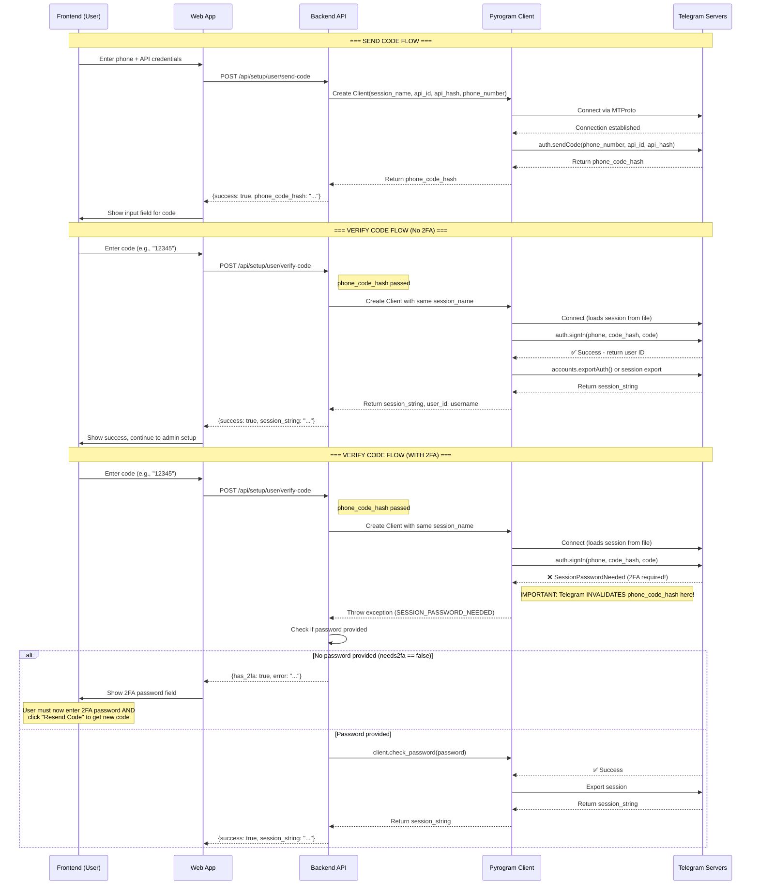

# TelePlay Setup Flow Documentation & Debugging

## Problem Summary

The Telegram setup wizard was experiencing multiple issues:
1. **Connection Timeout**: The `/setup/user/send-code` endpoint hung indefinitely
2. **PHONE_CODE_EXPIRED**: After entering a valid code, users received `PHONE_CODE_EXPIRED` error
3. **2FA Handling**: Accounts with two-factor authentication couldn't complete login

---

## Flow Diagram



---

## Root Cause Analysis

### Issue 1: Connection Hanging

**Problem**: The `/setup/user/send-code` endpoint would hang indefinitely instead of returning an error.

**Root Cause**: Pyrogram's MTProto connection doesn't have a default timeout. If Telegram's servers are slow to respond (common from certain regions like Iran), the connection would hang forever.

**Fix**: Added `asyncio.wait_for()` with 30-second timeout around all Pyrogram async operations:
```python
await asyncio.wait_for(client.connect(), timeout=30.0)
sent_code = await asyncio.wait_for(client.send_code(payload.phone), timeout=30.0)
```

### Issue 2: PHONE_CODE_EXPIRED Error

**Problem**: Users entered the correct code but got `PHONE_CODE_EXPIRED`.

**Root Cause**: When `sign_in()` is called on an account WITH 2FA enabled, but WITHOUT providing the password parameter, Telegram:
1. Recognizes the account has 2FA
2. Throws `SessionPasswordNeeded` exception
3. **IMMEDIATELY INVALIDATES the phone_code_hash** on their servers

This means any subsequent call with the same `phone_code_hash` will fail because Telegram considers it expired/consumed.

**Fix**: The 2FA flow now works in a two-step process:
1. First attempt with code only → catches `SessionPasswordNeeded`
2. Returns `has_2fa: true` to frontend
3. Frontend shows password field and tells user to click "Resend Code"
4. New code is sent (fresh phone_code_hash)
5. User enters BOTH code + password together
6. Backend calls `sign_in(code)` which now succeeds, then `check_password(password)`

### Issue 3: Proxy Requirements

**Problem**: Some servers (especially in restricted networks) cannot connect directly to Telegram's API.

**Fix**: Added support for `TELEGRAM_PROXY` environment variable:
```env
TELEGRAM_PROXY=socks5://proxy.example.com:1080
# or
TELEGRAM_PROXY=http://proxy.example.com:8080
```

---

## Correct Setup Flow (Final)

```
┌─────────────────────────────────────────────────────────────────┐
│                        SETUP FLOW                               │
└─────────────────────────────────────────────────────────────────┘

STEP 1: Bot Validation
┌──────────┐    ┌──────────┐    ┌──────────────┐
│  Frontend │───▶│  Backend │───▶│ Telegram Bot │
│            │    │          │    │    API       │
│ Enter bot  │    │ POST     │    │              │
│ token      │    │ /bot/    │───▶│ Returns bot  │
│            │    │ validate │    │ info         │
└──────────┘    └──────────┘    └──────────────┘


STEP 2: Send Code (User Account)
┌──────────┐    ┌──────────┐    ┌──────────────┐
│  Frontend │    │  Backend │    │Telegram MT    │
│          │    │          │    │   Proto      │
│ Enter     │───▶│POST /    │───▶│ auth.send    │
│ phone     │    │user/     │    │ Code()       │
│ api_id    │    │send-code │    │              │
│ api_hash  │    │          │◀───│ Returns      │
│          │    │          │    │ code_hash    │
└──────────┘    └──────────┘    └──────────────┘


STEP 3: Verify Code (No 2FA)
┌──────────┐    ┌──────────┐    ┌──────────────┐
│  Frontend │    │  Backend │    │Telegram MT    │
│          │    │          │    │   Proto      │
│ Enter    │───▶│ POST     │───▶│ auth.sign_   │
│ code     │    │user/     │    │ in()         │
│          │    │verify-    │    │              │
│          │    │code      │◀───│ Returns user │
│          │    │          │    │ info         │
└──────────┘    └──────────┘    └──────────────┘


STEP 3b: Verify Code (WITH 2FA)
┌──────────┐    ┌──────────┐    ┌──────────────┐
│  Frontend │    │  Backend │    │Telegram MT    │
│          │    │          │    │   Proto      │
│ Enter    │───▶│ POST     │    │              │
│ code     │    │user/     │    │ auth.sign_   │
│          │    │verify-    │───▶│ in() fails   │
│          │    │code      │◀───│ with          │
│          │    │          │    │ SessionPwd   │
│  Show    │◀───│ Return   │    │              │
│ password │    │ has_2fa  │    │              │
│ field    │    │ = true   │    │              │
└──────────┘    └──────────┘    └──────────────┘
                          │
                          │ User clicks "Resend Code"
                          │
                          ▼
                   New code sent (fresh hash!)
                          │
                          ▼
                  User enters code + password
                          │
                          ▼
                   POST /verify-code again
                          │
                          ▼
                   sign_in(code) fails
                          │
                          ▼
                   check_password(pwd) ✅
                          │
                          ▼
                   Success!


STEP 4: Complete Setup
┌──────────┐    ┌──────────┐    ┌──────────────┐
│  Frontend │    │  Backend │    │  Database    │
│          │    │          │    │              │
│ Enter    │───▶│ POST     │───▶│ Store bot    │
│ super_   │    │/complete │    │ config, user │
│ admin_id │    │          │    │ account,     │
│          │    │          │    │ create admin │
└──────────┘    └──────────┘    └──────────────┘
```

---

## Environment Variables

| Variable | Required | Description |
|----------|----------|-------------|
| `TELEGRAM_API_ID` | ✅ | From my.telegram.org |
| `TELEGRAM_API_HASH` | ✅ | From my.telegram.org |
| `TELEGRAM_BOT_TOKEN` | ✅ | From @BotFather |
| `TELEGRAM_STORAGE_CHANNEL_ID` | ✅ | Private channel ID |
| `TELEGRAM_PROXY` | ❌ | SOCKS5/HTTP proxy URL |
| `DATABASE_URL` | ✅ | Database connection string |
| `JWT_SECRET` | ✅ | JWT signing secret |

---

## Files Modified

| File | Changes |
|------|---------|
| `backend/app/routers/setup.py` | Added timeouts, proxy support, fixed 2FA flow |
| `backend/app/routers/admin_accounts.py` | Added timeouts, proxy support for admin flows |
| `backend/app/config.py` | Added `telegram_proxy` configuration field |
| `web/src/components/SetupPage.tsx` | Added 2FA password field, resend code button, improved UX |

---

## Testing Checklist

- [ ] Bot token validation works (GET /setup/bot/validate)
- [ ] Send code returns phone_code_hash without hanging
- [ ] Verify code works for accounts WITHOUT 2FA
- [ ] Verify code returns has_2fa=true for accounts WITH 2FA
- [ ] After 2FA prompt, resending code works with new hash
- [ ] Complete setup creates database records correctly
