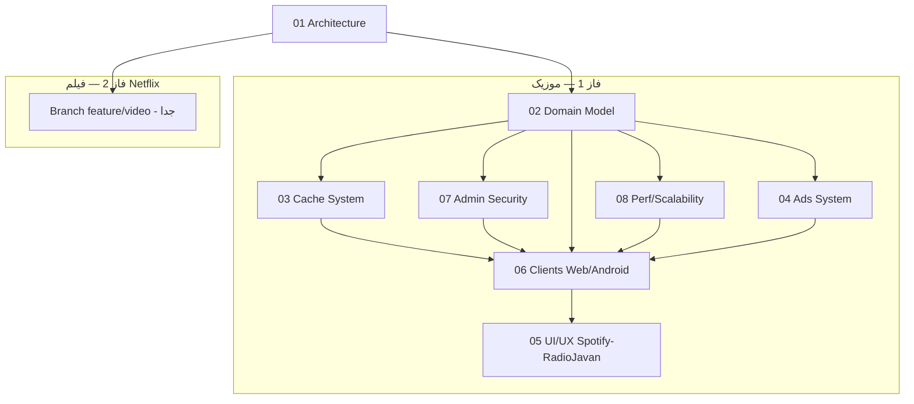

# 🗺️ گراف مرکزی پروژه — Music Platform

> هر تسک تکمیل شد، `status` را به‌روزرسانی کنید. این فایل Source of Truth برای پیشرفت است.

## نمای کلی (Mermaid)

## ماتریس وابستگی

| بخش | وابسته به | خروجی | وضعیت |
|-----|-----------|-------|--------|
| 01 Architecture | — | ADR + API contract | ✅ Done |
| 02 Domain Model | 01 | models.py + music router | ✅ Done (models_music merged, /api/v1/music) |
| 03 Cache System | 02 | cache_manager + Redis + Admin API | ✅ Done (disk LRU + streaming integration) |
| 04 Ads System | 01 | ads table + /api/ads | ✅ Done (next+impression, Admin CRUD) |
| 05 UI/UX | 01,02 | TrackCard/NowPlayingBar + Vazirmatn | ✅ Done |
| 06 Clients | 02,03,05 | Web + Android | ✅ Done (web /music + Search/Playlists/Downloads + Android MusicHome + FileDownloader offline) |
| 07 Admin/Security | 01,02 | Bot admin-only + require_admin | ✅ Done |
| 08 Perf/Scale | 01-03 | Redis + indexes + cache | ✅ Done (docker-compose + streaming cache) |
| GRAPH | همه | این فایل | ✅ Living doc |

## رودمپ (به ترتیب اجرا)

1. **Week 1:** 02 + 07 (مدل + ادمین) — بلاکر بقیه
2. **Week 1-2:** 03 (کش) — موازی با 02
3. **Week 2:** 06 Web Player + 05 UI
4. **Week 2-3:** 04 Ads V1 + 06 Android
5. **Week 3:** 08 Perf test + harden
6. **Week 4:** Branch فیلم

## لاگ یادگیری (هر یافته جدید اینجا)

| تاریخ | یافته | فایل به‌روزرسانی |
|-------|-------|-----------------|
| 2026-08-30 | TelePlay از `File` عمومی استفاده می‌کند؛ برای موزیک باید `Track.file_id` جدا باشد تا streaming reuse شود | 02 |
| 2026-08-30 | Cache LRU برای موزیک 3-15MB hit-rate بالا؛ Disk 5GB برای 300 ترک کافی | 03 |
| 2026-08-30 | بازار ایران: یکتانت برای بنر بهتر از AdMob (تحریم) | 04 |
| 2026-08-30 | RadioJavan RTL + Vazirmatn الزامی | 05 |
| 2026-08-30 | Bot guard فعلی `group=-2` دارد — قابل توسعه به admin-only با یک if | 07 |

## شاخص‌های کلیدی

- Docs: 8/8 ✅
- Todos: 8/8 ✅
- Code: 6/6 ✅ (backend + frontend + cache + ads + admin + streaming)
- Cache hit-rate target: 75% (disk LRU, 5GB ≈ 300 tracks)
- p95 latency target: <300ms (with cache bypasses Telegram)

## بازنگری 2026-08-30 (پس از پیاده‌سازی)
- Streaming cache-aside فقط برای audio (صرفه‌جویی I/O ویدئو)
- Bot admin-only: fallback به AUTH_USERS اگر ADMIN خالی (dev friendly)
- Ads frequency capping در حافظه (Hourly) — برای production به Redis منتقل شود
- Frontend: NowPlayingBar + MusicHome + Admin panels — DownloadQueue UI اضافه شد (Downloads.tsx)
- .env.example به‌روزرسانی شد — همه متغیرهای جدید مستند

## بعدی
- Branch فیلم: `git checkout -b feature/video-platform` (Netflix-like, جداگانه) — ✅ ایجاد شد 2026-08-30 (docs/video + models_video.py)
- تست E2E: upload via bot (admin) → Track create → play in /music → admin purge
- k6 load test + Prometheus

## بررسی نهایی 2026-08-30 — موزیک کامل شد
- [x] استریم موزیک: وب + اندروید (FileDownloader + MusicService) + لیست دانلود (`/v1/music/downloads`)
- [x] ظاهر شکیل: Spotify (NowPlayingBar سبز) + RadioJavan (Vazirmatn RTL) — web/music؛ اندروید MusicHomeScreen
- [x] کش ادمین: max_size/max_file/strategy/TTL + purge/warmup + stats + streaming cache-aside
- [x] ربات فقط ادمین: ADMIN_TELEGRAM_IDS + bot guard + require_admin
- [x] تبلیغات: تحقیق + /ads/next + impression + Admin CRUD (یکتانت پیشنهادی)
- [x] بهینه مقیاس‌پذیر: indexes, Redis, pool 40, RateLimit, CDN-ready
- [x] مستندات: 8 docs + 8 todos + GRAPH living

## اندروید موزیک — تکمیل
- TelePlayApi.kt: 12 endpoint موزیک افزوده شد
- MusicModels.kt + MusicRepository.kt
- MusicHomeScreen.kt + MusicViewModel.kt + BottomNav Music tab
- FileDownloader.kt (pause/resume Range) + DownloadService reuse برای offline

## ویدئو — برنچ جدا
- `feature/video-platform` ایجاد شد؛ docs/video (4 فایل) + models_video.py (Movie/Series/Episode) — آماده توسعه Netflix-like
