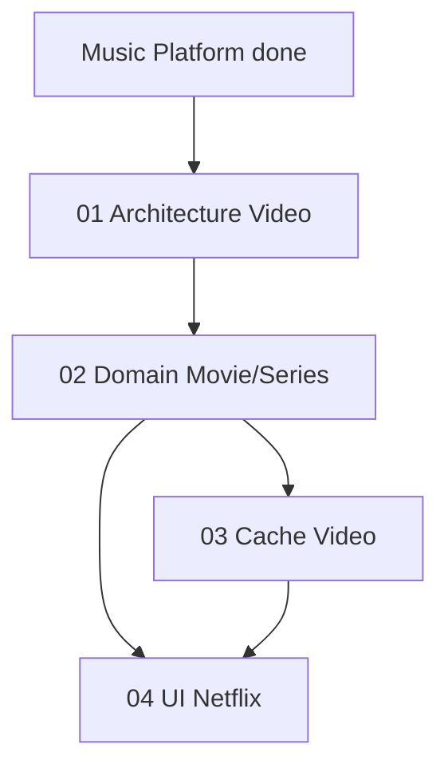

# 🗺️ گراف ویدئو (روی موزیک)

| بخش | وضعیت |
|-----|--------|
| 01 Architecture | ✅ Done |
| 02 Domain | ✅ Done (doc) |
| 03 Cache Video | ✅ Done (doc) |
| 04 UI Netflix | ✅ Done (doc) |
| Code Video | ⏳ Next: models + router + VideoRow/Hero |

## یادگیری (ویدئو)
- ویدئو 500MB+ → کش رنج‌بندی (2MB chunk) vs موزیک 30MB whole
- Netflix Hero + Row pattern → قابل reuse برای موزیک (Album Row)
