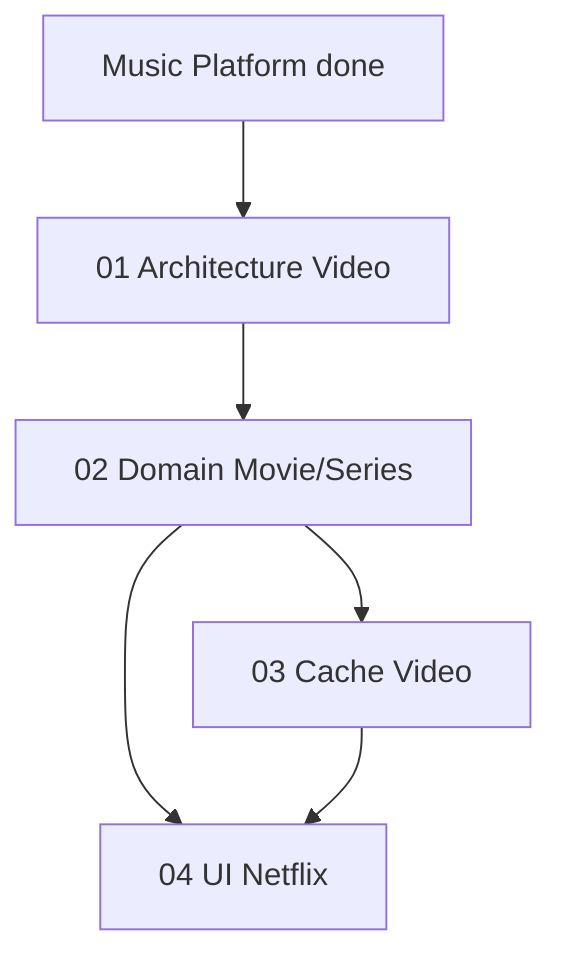

# 🗺️ گراف ویدئو (روی موزیک)

| بخش | وضعیت |
|-----|--------|
| 01 Architecture | ✅ Done |
| 02 Domain | ✅ Done (models.py Movie/Series/Episode/VideoProgress + schemas) |
| 03 Cache Video | ✅ Done (cache_manager video LRU 20GB + admin) |
| 04 UI Netflix | ✅ Done (web Hero/VideoRow/VideoCard/VideoHome + Sidebar Video link + /video route) |
| 05 Android TV | ✅ Done (VideoModels + VideoRepository + TelePlayApi video endpoints) |
| 06 Ads Pre-roll | ✅ Done (placeholder in VideoHome + future IMA) |

## یادگیری (ویدئو)
- ویدئو 500MB+ → کش رنج‌بندی (2MB chunk) vs موزیک 30MB whole
- Netflix Hero + Row pattern → قابل reuse برای موزیک (Album Row)
- 2026-08-30: ویدئو browse API: hero( featured) + continue_watching(VideoProgress) + by_genre(distinct)
- Cache video جدا: /cache/video با LRU مستقل تا موزیک evict نشود

## بازنگری نهایی 2026-08-30
- بک‌اند ویدیو کامل: models + schemas + router + cache + config
- فرانت وب: 4 کامپوننت Netflix-like، اندروید: 2 مدل + repo
- برنچ `feature/video-platform` آماده merge به `feature/music-platform` در صورت نیاز
